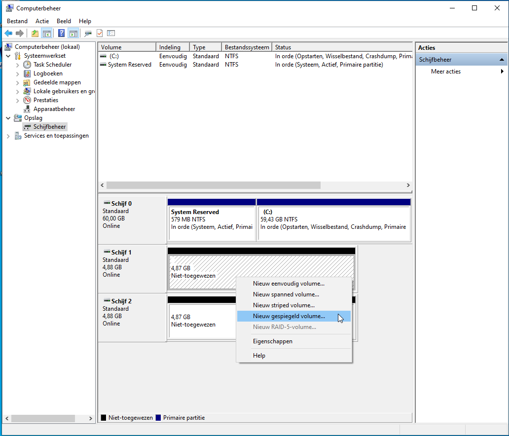

= Virtualization and RAID
UCLL
:doctype: article
:encoding: utf-8
:lang: en
:toc: left

== Virtualization

Watch (yes, only watch) the following youtube clips completely, https://youtu.be/wX75Z-4MEoM[clip 1], https://youtu.be/OWmD8obq4eQ[clip 2] and https://youtu.be/lzRMYTf6X2o[clip 3].

Now you know what virtualization is and what it does.

* Install VirtualBox and its Extension Pack.
* Create your first virtual **Windows 10** machine, with 1 CPU, 1024 MB memory and 20 GB disk storage.
** If you are unsure about some settings, just try some. If they appear to be wrong, you can always delete the virtual machine and start over. 
* Create your second virtual **Debian 11 GNU/Linux** machine with also 1 CPU, 1024 MB memory and 8 GB disk storage. 
** If you are unsure about some settings, just try some. If they appear to be wrong, you can always delete the virtual machine and start over.

== Snapshots

More information about snapshots can be found on this https://www.techrepublic.com/article/how-to-use-snapshots-in-virtualbox[link]. It would be wise to read this documentation, before asking questions. 

* Create a snapshot of the two VMs and name the snapshot **Initial installation**. 
* Update the VMs and create a new snapshot, **updates until ../../2022**.
** How to update/upgrade Windows? Windows update!
** How to update/upgrade all software on Debian?

    su - root
    (enter the root password)
    apt update
    apt -y upgrade
    (after the installation => reboot)

== Clones

More information about VirtualBox can be found in the official https://docs.oracle.com/en/virtualization/virtualbox/6.1/user/[documentaion]. Find the information about **cloning a VM**. It would be wise to read this documentation, before asking questions. 

* Create a linked clone of the "Windows 10-Initial installation"-snapshot. 
** What is the difference between a full clone and a linked clone => RTFM. 

== Networking in VirtualBox

Watch following youtube https://youtu.be/vReAkOq-59I[clip]. Read following https://www.nakivo.com/blog/virtualbox-network-setting-guide[guide]. It would be wise to read this documentation, before asking questions. 

* Create a NAT-network with IP-range 10.10.20.0/24 and enable the DHCP-server.
* Shutdown the Windows 10 VM and the Debian 11 VM and put then on this newly created NAT-network and start them.
* Explain the difference between a NAT-network and a Host-only-network as if this was a question on an evaluation. 
* Use the `ping` command to send an ICMP package between the VMs. 
** More information about ping and ICMP can be found in the networking courses.

== RAID

RAID allows hard disks to be combined into one large drive, with faster read and write speeds and higher reliability.

    RAID is not a substitute for BACKUP! Backups aim to restore old data if necessary. RAID does not provide that capability.

RAID allows you to bundle multiple hard drives in such a way that an operating system (Windows, MacOS X, Linux, etc) sees it as one single large hard drive.

The different variations of RAID or RAID level each have their own purpose, advantages and disadvantages. You can think of speed, more storage capacity or higher reliability.

The different levels start with the word “RAID” followed by a number. For example RAID 0, RAID 1, etc.

In the past, RAID was only used in servers by means of expensive hardware RAID controllers.

Today, RAID is used in servers, desktop computers and laptops, external disk arrays and NAS (Network Attached Storage), where the "controller" can be both hardware and software.

=== How to set up RAID 1 on Windows 10

Keep in mind that it's best to use drives of the same make, model, and capacity when building a RAID. Give your VM 2 extra disks of 2GB each.

* If a disk in offline, bring it online.

* Initialize the disks with GPT.

* Windows requires the disks to be at least 5 GB to be part of RAID-configuration. So *extend* the disks to 5 GB each with Virtualbox **Virtual Media Manager** 

* Create a mirrored volume.

That is it! It will take Windows a while to format the drives for use, but when it's all done, you'll have a shiny new RAID 1 array.

=== How to set up RAID 1 on Linux

Give your Linux VM 2 extra disks of 2GB each. Linux doesn't come with the software that handles RAID out-of-the-box, so we have to download and install it. Open a terminal and enter the following command:

 su - root
 (root password)
 apt install -y mdadm

We need to know which devices are connected. You can use lsblk command to find out `lsblk -o name, size, type, model`.

Once you've identified the drives you want to use, use the mdadm command to create your array. Install an ext4 filesystem on it and mount it at /mnt/md1.

 mdadm --create /dev/md1 --level=1 --raid-devices=2 /dev/sdb /dev/sdc
 mkfs.ext4 /dev/md1
 mkdir /mnt/md1
 mount /dev/md1 /mnt/md1

== Learning goals to achieve for this lab

* You can explain what a virtual machine is. 
* You can explain what a hypervisor is. 
* You can explain the difference between a type 1 and type 2 hypervisor.
* You can explain why some one should need a virtual machine.
* You can explain what an iso-image is and wherefore it is used.
* You can install a virtual machine with an iso-image.
* You can change your computers BIOS/UEFI settings to enable hardware support for virtualization.
* You can install VirtualBox as hypervisor.
* You can install the VM VirtualBox Extension Pack.
* You can install VirtualBox’s Guest Additions package inside a Windows virtual machine. 
* You can explain what a snapshot of a VM is.
* You can explain what a clone of a VM is.
* You can explain in detail the difference between a snapshot and a clone of a VM. 
* You can explain in detail the difference between a Linked clone and a full clone. 
* You can create a snapshot and a clone of a virtual machine.
* You can explain the different networking types in VirtualBox.
* You can create and modify a NAT network and a Host-only network in VirtualBox. 
* You can change the networking settings of a VM.
* You can change the disk settings of a VM.
* You can enlarge a virtual disk of a VM.
* You can change to boot-start-up-order of a VM (CD, disk, Network, ...).
* You can create and mount (make available) a RAID-1 disk on Windows and Linux. 
* You can use VirtualBox's official documentation to explain VirtualBox's features. 
